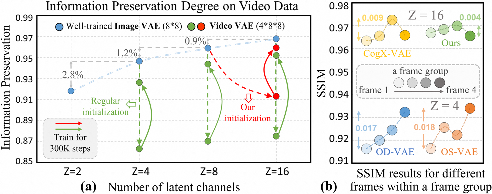
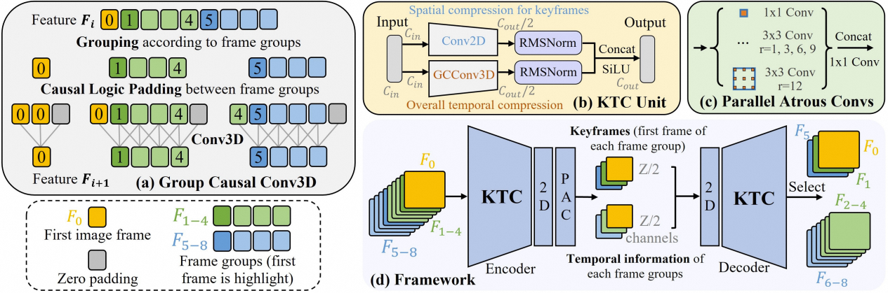
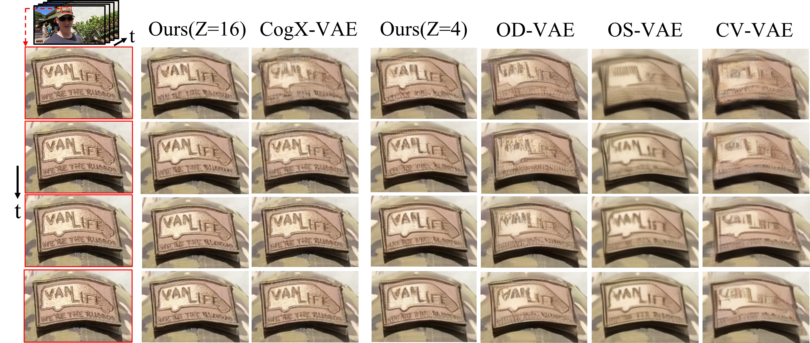
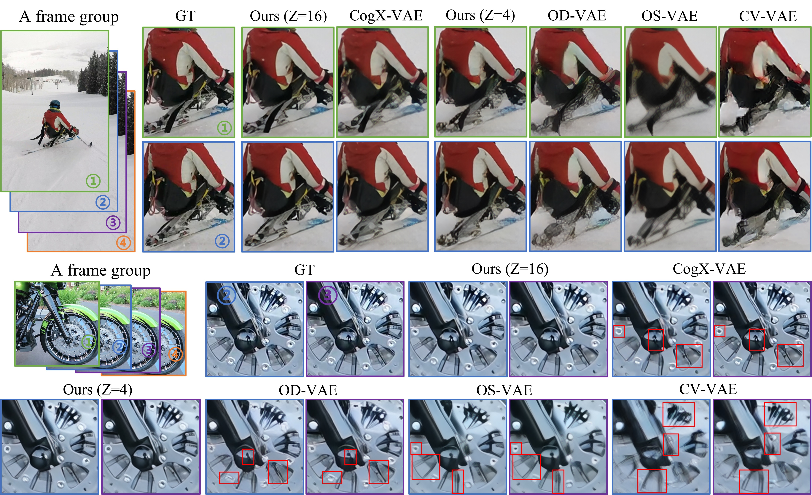

# Improved Video VAE For Latent Video Diffusion Model

PyTorch implementation of ''Improved Video VAE For Latent Video Diffusion Model''.

## 📋 Table of content
 1. [📎 Paper Link](#1)
 2. [💡 Abstract](#2)
 3. [📖 Method](#3)
 4. [✏️ Usage](#4)
    1. [Download Trained Models](#41) 
    2. [Video reconstruction](#42)
 5. [⛺ Experimental Results](#5) 
 6. [✉️ Statement](#9)

## 📎 Paper Link <a name="1"></a> 

* Improved Video VAE For Latent Video Diffusion Model

    Authors: Pingyu Wu, Kai Zhu, Yu Liu, Liming Zhao, Wei Zhai, Yang Cao, Zheng-Jun Zha

## 💡 Abstract <a name="2"></a> 
Variational Autoencoder (VAE) aims to compress pixel data into low-dimensional latent space, playing an important role in OpenAI's Sora and other latent video diffusion generation models. While most of existing video VAEs inflate a pretrained image VAE into the 3D causal structure for temporal-spatial compression, this paper presents two astonishing findings: (1) The initialization from a well-trained image VAE with the same latent dimensions suppresses the improvement of subsequent temporal compression capabilities. (2) The adoption of causal reasoning leads to unequal information interactions and unbalanced performance between frames. To alleviate these problems, we propose a keyframe-based temporal compression (KTC) architecture and a group causal convolution (GCConv) module to further improve video VAE (IV-VAE). Specifically, the KTC architecture divides the latent space into two branches, in which one half completely inherits the compression prior of keyframes from lower-dimension image VAEs while the other half involves temporal compression into the 3D group causal convolution, reducing temporal-spatial conflicts and accelerating the convergence speed of video VAE. The GCConv in above 3D half uses standard convolution within each frame group to ensure inter-frame equivalence, and employs causal logical padding between groups to maintain flexibility in processing variable frame video. Extensive experiments on five benchmarks demonstrate the SOTA video reconstruction and generation capabilities of the proposed IV-VAE.


<p align="center">
     <br />
    <em> 
    </em>
</p>

**(a) Information preservation degree** of reconstruction results for different VAEs on video data. **(b) Performance of different frames within a frame group** on kinetics-600 dataset.


## 📖 Method <a name="3"></a> 

<p align="center">
     <br />
    <em> 
    </em>
</p>

(a-c) **Basic components of IV-VAE.**: (d) **Overall Framework.**

## ✏️ Usage <a name="4"></a> 

### Download Trained Models <a name="41"></a> 

You can download all the trained models here  ([Google Drive]( https://drive.google.com))

### Video reconstruction <a name="42"></a> 

```bash  
python rec_video.py  
```


## ⛺ Experimental Results <a name="5"></a> 

<p align="center">
     <br />
    <em> 
    </em>
</p>

<p align="center">
     <br />
    <em> 
    </em>
</p>


## ✉️ Statement <a name="6"></a> 
For any other questions please contact [wpy364755620@mail.ustc.edu.cn](wpy364755620@mail.ustc.edu.cn).


